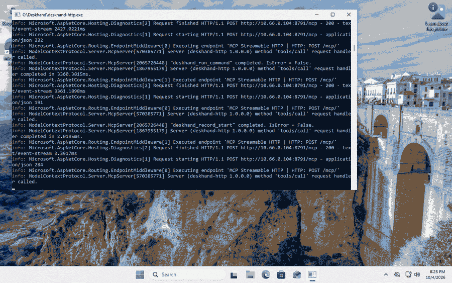
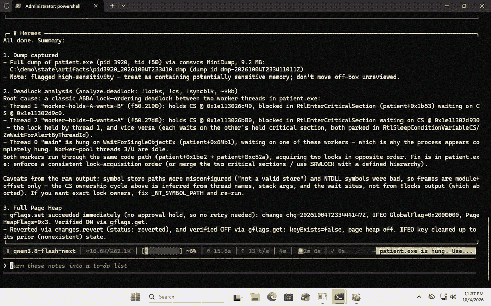

# Heisenberg demo

**New here? Watch the explained walkthrough: [`tutorial.mp4`](tutorial.mp4)** — a
slower, narrated version with "why/what" callouts for each step. It makes the
analysis explicit: `analyze.deadlock` opens the dump in **cdb** (the command-line
debugger from the Debugging Tools for Windows — the same engine as the WinDbg
GUI) and runs `!locks; !cs -l; !syncblk; ~*kb`; the video shows the exact cdb
command line and the real cdb output (the two critical sections and their owning
threads) that reveal the AB-BA deadlock.

A single-take, ~90-second story you can screen-record: **an AI agent diagnoses a
hung Windows process from a memory dump, then proposes a machine change that the
box's safety policy blocks until a human approves it out of band — and that is
reversed cleanly afterwards.**

It shows the three things that make Heisenberg more than a tool wrapper: real
end-to-end debugging, the risk-tiered consent model, and a reversible,
audited change ledger.



*Recorded on a disposable Groundhog-provisioned Windows 11 box (elevated), so the
gated step is `gflags.set` (Full Page Heap via IFEO), blocked until approval.*

**Higher-quality video with a live log viewer:
[`demo-live.mp4`](demo-live.mp4)** — the same run with a second pane tailing
Heisenberg's `calls.jsonl` (`logview.ps1`), so you watch each tool-call result
(`env.check`, `dump.capture`, `analyze.deadlock`, `gflags.set [RequiresApproval]`
→ `[ok]`, `changes.revert`) stream in live beside the narration.

## What it does

`run_demo.py` is a narrated driver. Every `agent ▸` line is a real Heisenberg
tool call over MCP; the narration just frames what the agent is doing.

1. **Deploy check** — `heisenberg selfcheck`: policy in force (fail-safe
   **Critical**), elevation, and which tools resolve on the box.
2. **The patient** — launches `patient.exe`, a tiny program that deadlocks two
   threads AB-BA (takes two Win32 critical sections in opposite order).
3. **Investigate** — the agent runs `env.check`, `dump.capture` (full dump of
   the hung pid), then `analyze.deadlock` and reports the lock-wait root cause.
4. **The gate** — the agent proposes a state-changing fix; on a Critical box it
   is **blocked, needing human approval**. The agent cannot proceed on its own.
5. **Approval** — a human runs `heisenberg approve <tool>` out of band; the agent
   retries and it applies.
6. **Reversible** — the change is in the ledger; `changes.revert` rolls it back.

## Run it

From the repo root, in a terminal sized ~100×32 (Windows Terminal, UTF-8):

```powershell
python demo\run_demo.py
```

The driver builds `heisenberg` (release) and the patient if needed. Pacing and
the binary path are configurable:

```powershell
$env:DEMO_PAUSE = "1.4"   # seconds between beats (0 = no pacing, for quick checks)
$env:DEMO_EXE   = "C:\path\to\heisenberg.exe"
```

Nothing touches the real machine: state goes to a throwaway `HEISENBERG_HOME`
under `%TEMP%`, and the one change made (step 5) is reverted in step 6.

`run_demo.ps1` is the same demo as a native PowerShell driver (no Python needed),
used to record the GIF above on a VM: it maximizes the console, auto-detects cdb
from the Store WinDbg package if the classic Debugging Tools aren't present, and
writes a `demo_done.flag` when finished so a screen recorder knows when to stop.

## Prerequisites

- **cdb** from the Debugging Tools for Windows (ships in the Windows SDK) for the
  dump analysis. `selfcheck` reports whether it's found; without it, step 3 still
  captures a dump but can't analyze it. Stage tools with `tools.install` or point
  `HEISENBERG_TOOLS` at a folder.
- Internet (optional) so cdb can pull `ntdll` symbols from the Microsoft symbol
  server; offline, the stacks still show the lock waits by module+offset.

## Recording tips

- Use Windows Terminal (UTF-8, a clear monospace font, ~100×32) and a plain
  background profile.
- Record with the Xbox Game Bar (`Win+Alt+R`) or OBS; trim to the run.
- For a GIF, convert the capture (e.g. with ffmpeg or ScreenToGif) and save it as
  `demo/demo.gif` so the image at the top of this file renders.
- `DEMO_PAUSE=1.4` gives a natural narrated pace; bump it up for a slower read.

## Driving Heisenberg from another agent (Hermes)

Heisenberg is a plain stdio MCP server, so any agent that speaks MCP can drive it
— here it's [Hermes Agent](https://github.com/NousResearch/hermes-agent) running a
local model (`qwen3.8-flash-next`), diagnosing the same hung process and hitting
the same safety gate.



Hermes picked the tools itself (dump capture → `analyze.deadlock` → `gflags.set`
→ `changes.revert`), named the deadlocked threads from the dump, and when
`gflags.set` returned `RequiresApproval` on the Critical box it waited for an
out-of-band `heisenberg approve gflags.set` before retrying — exactly the broker
flow, now driven by a third-party agent.

**Video with the live tool-call log:
[`hermes-live.mp4`](hermes-live.mp4)** — the Hermes TUI on the left (its own
reasoning and tool calls) and Heisenberg's `calls.jsonl` tailing on the right,
so you watch the agent drive the tools *and* see each result land: the deadlock
dump + analysis, then `gflags.set [RequiresApproval]` → operator approves →
`[ok]` → `changes.revert`.

Register Heisenberg in the agent's MCP config (Hermes' `config.yaml` shown; the
shape is the same for any client). The `env:` block points the locator at `cdb`
and a symbol cache so analysis works:

```yaml
mcp_servers:
  heisenberg:
    command: "C:/path/to/heisenberg.exe"
    env:
      HEISENBERG_HOME: "C:/ProgramData/Heisenberg"
      HEISENBERG_TOOLS: "C:/path/to/Debuggers/amd64"   # folder containing cdb.exe
      _NT_SYMBOL_PATH: "srv*C:/symcache*https://msdl.microsoft.com/download/symbols"
    timeout: 300
```

The agent then sees every Heisenberg tool as `mcp__heisenberg__<tool>`. The box's
risk policy still applies: a Critical box returns `RequiresApproval` for mutations
until a human runs `heisenberg approve <tool>` — the agent can't self-approve.

## Elevated variant

Run the demo from an **elevated** terminal and the gated step becomes
`gflags.set` (enable Full Page Heap via IFEO) instead of `symbols.configure` —
a more dramatic machine change, still blocked → approved → applied → reverted.
The driver picks this automatically when it detects it's running as admin.

## The patient

`demo/patient/` is a standalone zero-dependency crate. Modes:

```powershell
patient.exe            # deadlock (default): two threads, AB-BA critical sections
patient.exe crash      # null-pointer dereference -> access violation
```
